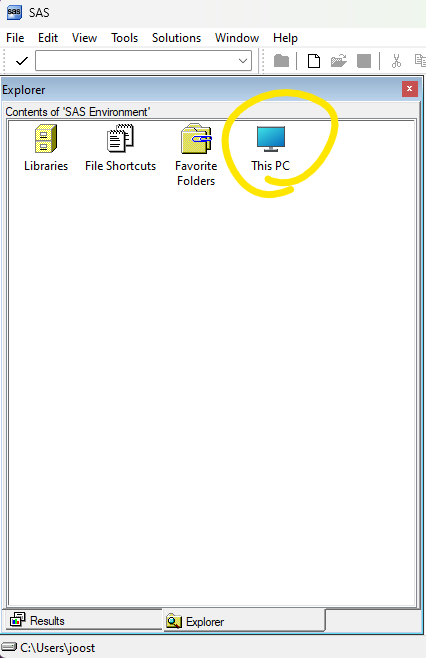
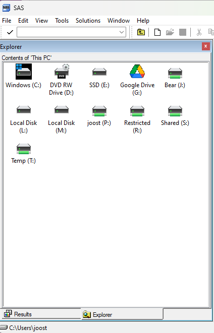
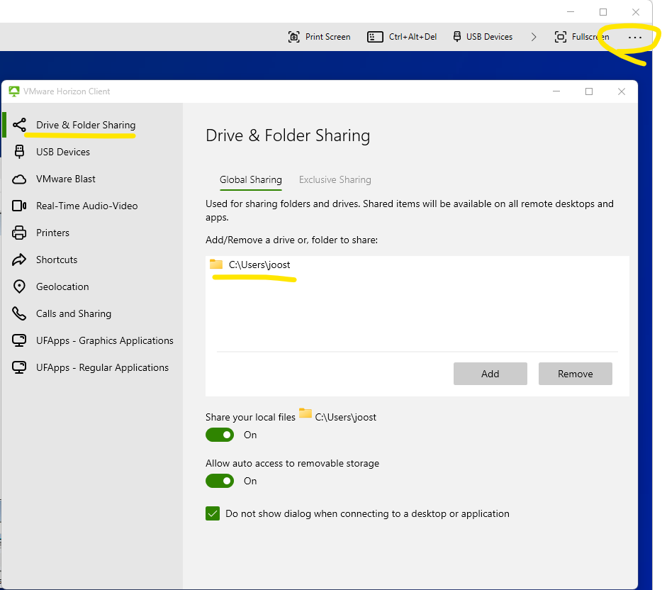
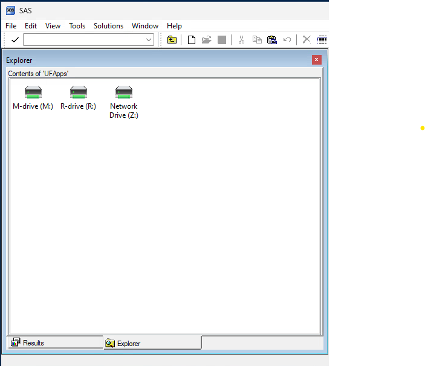

# Libraries and `rsubmit`

## Libraries <a name="libraries"></a>

In SAS, libraries are essential for organizing and accessing data. A library in SAS is essentially a pointer to a location (folder) where the datasets are stored. 

### Creating a library

To create a library reference, you use the `libname` statement, which assigns a name (libref) to the library and defines its path. For example, `libname mylib 'E:\temp\today';` creates a library named `mylib` that refers to datasets stored in the `E:\temp\today` directory. Make sure the folder actually exists.

```sas
/* change to your setting and make sure the folder exists
h is pointing to folder E:\temp\today */
libname h "E:\temp\today";
```
> The folder structure depends on the system where SAS is installed. If you run SAS on a virtual machine (like UF Apps), the folder may not simply be C:\Users\etc, and if you run SAS on WRDS, there is a linux folder structure where '~' is your home folder.

To view the folder structure, select the 'Explorer' in the left panel (bottom), this allows you to navigate through libraries ('Libraries') and the file system ('This PC')



Clicking on 'This PC' shows the drives that are available:



> Browsing drives and folders isn't part of a normal workflow, as the operating system already has good functionality to do so. It is useful when it is not clear what drives/folders SAS has access to. The top line 'Contents of 'This PC'' will change to an exact path when displaying folders. This exact path can then be copy-pasted into a 'libname' statement.

### UF Apps

When you run SAS on UF Apps you are in a virtual machine environment, which has its own folder structure. UF Apps uses 'Horizon' to run the virtual machine. 

UF Apps login: [https://portal.apps.ufl.edu/](https://portal.apps.ufl.edu/)

The first time you start Horizon you need to give permission for it to access your hard disk. To set these permissions at a later point, see these instructions: 
https://info.apps.ufl.edu/frequently-asked-questions/troubleshooting/opening-and-saving-files/

To map a local folder, click on the '...' icon (top right), and select 'settings'. Then select 'Drive & Folder Sharing':



I have added 'C:\Users\joost'. The Z drive in Horizon will point to this folder.

This is the 'explorer' window, after clicking on 'UF-Apps'. Clicking on 'Network Drive (Z:)' will show the files and folders on my local folder C:\User\joost.




### Referencing files in a library

Once a library is created, you can access datasets within it using a two-level naming convention: `libref.dataset`. Libraries make data management more efficient by enabling easy reference and modification of datasets throughout a SAS session.

```sas
/* This will create hello.sas7bdat in the folder */
data h.hello;
x = 1;
msg = 'hi there';
run;

/* This will make a copy of the dataset in the (temporary) work library */
data hellocopy;
set h.hello;
run;
```

---

## `rsubmit` <a name="rsubmit"></a>

In SAS, the `rsubmit` statement is used to execute code on a remote server from a local session. It is a key feature of SAS/CONNECT, enabling distributed processing by allowing users to send blocks of code to a remote SAS session for execution. This is particularly useful when working in a client-server setup, where the user’s machine has limited resources but the remote server offers greater computational power or access to specific data. The code enclosed within the `rsubmit` block is executed remotely, and the results are returned to the local session. Additionally, `endrsubmit` marks the end of the remote block of code. This feature enhances efficiency, especially for large data processing tasks, as it minimizes data transfer and leverages the server’s processing capabilities.

### Sign on

Before you can use `submit` you need to sign on the remote server. The following example makes a WRDS connection. `username=_prompt_` will ask for the username (as well as the password). You can replace `_prompt_` with your username. 

Note that you may get a Duo confirmation. It is also possible for the sign on to fail, for example if there are too many connections open. See the error message for instructions on how to 'kill' these connections.

```sas
/* Remote access: setup, defining the connection */
%let wrds = wrds.wharton.upenn.edu 4016;options comamid = TCP remote=WRDS;
signon username=_prompt_;
```

Note that the connection will time out after inactivity (15 or 20 minutes or so). The following code will prevent some time-out errors:

```sas
/* An empty rsubmit block will test if the connection is still active 
If it is no longer active, then the sign on will ask for credentials
*/
rsubmit; endrsubmit;
%let wrds = wrds.wharton.upenn.edu 4016;options comamid = TCP remote=WRDS;
signon username=_prompt_;
```


### Example of `rsubmit` where a message gets logged

While this example may not seem to be spectacular, it is quite something that we get to control a SAS session from our PC that runs on WRDS' servers:

```sas
/* rsubmit, endrsubmit block */
rsubmit;
	/* this code runs on WRDS */
	%put hi;

endrsubmit;
```

### `rsubmit` example Funda

The following example gets data from Compustat Funda:

```sas
/* rsubmit, endrsubmit block */
rsubmit;

	/* this code runs on WRDS */
	
	data a_comp (keep = gvkey fyear datadate cik conm sich sale at ni ceq prcc_f csho xrd curcd);
	set comp.funda;
	/* years 2010 and later*/
	if fyear >= 2010;

	/* prevent double records (specific to Compustat Funda only, other datasets do't need this) */
	if indfmt='INDL' and datafmt='STD' and popsrc='D' and consol='C' ;
	run;

endrsubmit;
```

---

## `proc upload` and `proc download` <a name="upload"></a>

In SAS, the `proc upload` and `proc download` procedures are used within an `rsubmit` block to transfer datasets between a local session and a remote session. `proc upload` allows users to send data from their local environment to the remote server, which is useful when the data needs to be processed remotely or stored centrally. Conversely, `proc download` retrieves datasets from the remote server to the local session, enabling local analysis or further manipulation. These procedures are often used in conjunction with the `rsubmit` statement to facilitate smooth data transfers in a distributed environment. 

For example, after running the previous code that creates a_comp:

```sas
rsubmit;
   /* This will download a_comp to the local work library */
   proc download data=a_comp out=a_comp;
   run;
endrsubmit;
```

> The session needs to be still active. If the session is timed out, you will need to sign on again, and re-run the code to create a_comp.

This allows for efficient movement of data between environments, minimizing the need to manually move files and ensuring seamless remote execution. Source code (.sas files) can also be moved with `proc upload` and `proc download`.

---

## Upload sas code within an rsubmit block - example 

In this example we upload a sas file ('example rsubmit.sas'), see folder '1 example rsubmit'. The contents of this file is as follows:

```sas
/* This code will be uploaded and then included (%include) on WRDS
So there is no need for rsubmit and endrsubmit */

data a_comp (keep = gvkey fyear datadate cik conm sich sale at ni ceq prcc_f csho xrd curcd);
set comp.funda;

/* years 2010 and later*/
if fyear >= 2010;

/* prevent double records (specific to Compustat Funda only, other datasets do't need this) */
if indfmt='INDL' and datafmt='STD' and popsrc='D' and consol='C' ;
run;
```

The following code establishes a connection with WRDS, uploads the file 'example rsubmit.sas' (ensure to adjust the file path—C:\git\...—if necessary), executes it using the %include statement, and then downloads the dataset it creates (a_comp):

```sas
/* make sure the connection is active */
rsubmit; endrsubmit;
%let wrds = wrds.wharton.upenn.edu 4016;options comamid = TCP remote=WRDS;
signon username=_prompt_;

/* rsubmit-endrsubmit block */
rsubmit;

/* full path to file, relative paths doesn't work */
proc upload 
	infile='C:\git\sas-wrds\1 - rsubmit import export\1 example rsubmit\example rsubmit.sas' 
	outfile='~/example.sas'; /* doesn't have to be the same file name */
run;

/* run it, it will create a_comp, the screen may 'freeze' on the upload of the code while it runs */
%include '~/example.sas';

/* download the dataset that was created */
proc download data=a_comp out=a_comp;run;

endrsubmit;
```

---

## Remote viewing of libraries <a name="rview"></a>

Remote viewing of libraries in SAS allows users to browse datasets stored on a remote server. It is important to note that when using remote libraries, the view doesn't automatically refresh if the datasets change. To see updated content, users need to navigate out of the library and back in again. This approach is useful when working with large datasets on a remote server without needing to move them to a local environment, optimizing both storage and processing efficiency.

```sas
/* remote library assignment: this allows us to browse the remote work folder  */

libname rwork slibref=work server=wrds;
libname rcrsp slibref=crsp server=wrds;
```

---

## SAS Studio on WRDS <a name="sasstudio"></a>

When using SAS Studio on the WRDS (Wharton Research Data Services) platform, the `rsubmit` statement is not required because SAS Studio is hosted directly by WRDS. This setup allows users to have seamless and direct access to WRDS data without needing to connect to a remote server through `rsubmit`. You can access SAS Studio at [https://wrds-cloud.wharton.upenn.edu/SASStudio/](https://wrds-cloud.wharton.upenn.edu/SASStudio/).


